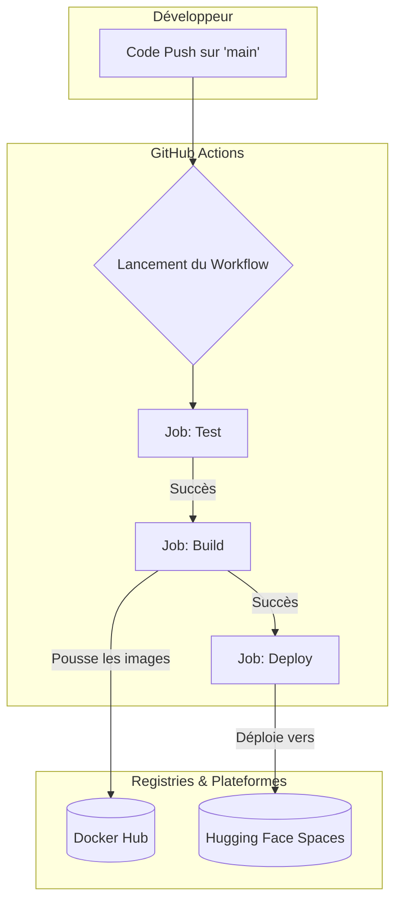

# Note Technique : Module de Segmentation d'Images pour Véhicule Autonome

**Projet** : Conception d'une voiture autonome (Projet 8)  
**Auteur** : Emmanuel OUEDRAOGO  
**Poste**  : Ingénieur IA, R&D  
**Date**   : 2024-05-24  
**Version** : 1.0

---

## Table des matières
1. Introduction et Contexte
    - 1.1. Mission du projet
    - 1.2. État de l'art de la segmentation sémantique
2. Approche Méthodologique
    - 2.1. Jeu de données : Cityscapes
    - 2.2. Préparation et augmentation des données
3. Architecture du Modèle Retenu
    - 3.1. Choix de l'architecture : MobileNetV2-UNet
    - 3.2. Structure détaillée
4. Expérimentations et Résultats
    - 4.1. Stratégie expérimentale
    - 4.2. Synthèse des résultats
    - 4.3. Impact de l'augmentation des données
    - 4.4. Optimisation des hyperparamètres
5. Déploiement et Industrialisation
    - 5.1. Architecture de l'API
    - 5.2. Pipeline CI/CD
6. Conclusion et Pistes d'Amélioration
    - 6.1. Synthèse
    - 6.2. Pistes d'amélioration

---

## 1. Introduction et Contexte

### 1.1. Mission du projet

Cette note technique documente le développement du module de segmentation d'images pour le système de vision par ordinateur des véhicules autonomes de Future Vision Transport. L'objectif est de fournir au système de décision une compréhension sémantique fine et en temps réel de l'environnement routier.

Le module doit être capable d'identifier et de segmenter (classifier chaque pixel) 8 catégories d'objets critiques pour la navigation :

1.  !#804080 **Flat** : Regroupe les surfaces planes (`road`, `sidewalk`, `parking`, `rail track`).
2.  !#dc143c **Human** : Cibles humaines (`person`, `rider`).
3.  !#00008e **Vehicle** : Tous les types de véhicules (`car`, `truck`, `bus`, `motorcycle`, `bicycle`, `train`, `caravan`, `trailer`).
4.  !#464646 **Construction** : Structures fixes (`building`, `wall`, `fence`, `guard rail`, `bridge`, `tunnel`).
5.  !#dcdc00 **Object** : Objets verticaux et signalisation (`pole`, `pole group`, `traffic sign`, `traffic light`).
6.  !#6b8e23 **Nature** : Éléments naturels (`vegetation`, `terrain`).
7.  !#4682b4 **Sky** : Le ciel (`sky`).
8.  !#000000 **Void** : Pixels non pertinents ou non étiquetés (`unlabeled`, `ego vehicle`, `out of roi`, `static`, `dynamic`, `ground`, etc.).

Ce module s'intègre entre le composant de traitement d'image brut et le système de décision, jouant un rôle crucial dans la perception de l'environnement.

### 1.2. État de l'art de la segmentation sémantique

La segmentation sémantique est une tâche fondamentale en vision par ordinateur. Plusieurs architectures de type *Deep Learning* ont démontré des performances exceptionnelles.

- **Fully Convolutional Networks (FCN)** : L'approche pionnière qui a popularisé l'utilisation de réseaux de neurones entièrement convolutionnels pour la segmentation, en remplaçant les couches denses des classifieurs par des couches convolutionnelles pour préserver l'information spatiale.

- **U-Net** : Initialement conçue pour la segmentation d'images médicales, l'architecture U-Net est devenue un standard. Sa structure symétrique en "U" avec un chemin de contraction (encodeur) et un chemin d'expansion (décodeur) est particulièrement efficace. Les **connexions résiduelles (skip connections)** entre l'encodeur et le décodeur permettent de combiner les caractéristiques sémantiques profondes avec les détails spatiaux fins, produisant des masques de segmentation très précis.

- **DeepLab** : La famille des modèles DeepLab (v1, v2, v3, v3+) a introduit des concepts clés pour améliorer la segmentation, notamment les **convolutions à trous (atrous convolutions)**. Celles-ci permettent d'agrandir le champ réceptif des filtres sans augmenter le nombre de paramètres, capturant ainsi un contexte plus large. DeepLabV3+ utilise également un module *Atrous Spatial Pyramid Pooling (ASPP)* pour sonder les caractéristiques à différentes échelles.

- **Architectures légères pour l'embarqué** : Pour des applications en temps réel comme la conduite autonome, l'efficacité de l'inférence est primordiale. Des architectures comme **MobileNet**, **SqueezeNet** ou **EfficientNet** sont souvent utilisées comme "backbone" (encodeur) pour des modèles de segmentation. Elles sont conçées pour minimiser la complexité de calcul et la taille du modèle, tout en conservant de bonnes performances.

Notre choix s'est porté sur une architecture hybride combinant les forces de U-Net et de MobileNetV2, afin d'obtenir un excellent compromis entre précision et vitesse d'inférence.

---

## 2. Approche Méthodologique

### 2.1. Jeu de données : Cityscapes

Nous avons utilisé le jeu de données de référence **Cityscapes**, spécialisé dans la compréhension de scènes urbaines.

- **Volume** : 5 000 images avec annotations fines (2 975 pour l'entraînement, 500 pour la validation, 1 525 pour le test).
- **Qualité** : Annotations polygonales denses et précises.
- **Diversité** : Images provenant de 50 villes différentes, capturées sur plusieurs mois et dans des conditions météorologiques variées.
- **Complexité** : Scènes sélectionnées pour leur richesse en objets dynamiques et leurs arrière-plans variés.

### 2.2. Préparation et augmentation des données

#### Mapping des classes
Les 30+ classes originales de Cityscapes ont été regroupées en 8 catégories fonctionnelles, conformément aux besoins du projet. Un tableau de correspondance a été créé pour mapper les ID de classe originaux vers nos 8 groupes cibles lors du chargement des masques.

Pour une efficacité maximale, ce mapping est implémenté via une table de correspondance (lookup table) NumPy.

```python
cityscapes_mapping = {
    # original_id: group_id
    0: 7, 1: 7, 2: 7, 3: 7, 4: 7, 5: 7, 6: 7, # void
    7: 0, 8: 0, 9: 0, 10: 0, # flat
    11: 3, 12: 3, 13: 3, 14: 3, 15: 3, 16: 3, # construction
    17: 4, 18: 4, 19: 4, 20: 4, # object
    21: 5, 22: 5, # nature
    23: 6, # sky
    24: 1, 25: 1, # human
    26: 2, 27: 2, 28: 2, 29: 2, 30: 2, 31: 2, 32: 2, 33: 2 # vehicle
}
```

#### Pipeline de données `tf.data`
Pour une gestion efficace des données, nous avons mis en place un pipeline avec `tf.data` :
1.  Chargement des chemins des images et des masques.
2.  Décodage et redimensionnement des images à une taille fixe de **(224, 224)**. L'interpolation bilinéaire est utilisée pour les images et "au plus proche voisin" (nearest neighbor) pour les masques afin de ne pas altérer les ID de classe.
3.  Normalisation des pixels des images dans l'intervalle `[0, 1]`.
4.  Application du mapping des classes sur les masques.
5.  Mise en cache, mélange (`shuffle`) et pré-chargement (`prefetch`) pour optimiser les performances d'entraînement et éviter les goulots d'étranglement I/O.

#### Augmentation des données (Data Augmentation)
Pour améliorer la robustesse et la capacité de généralisation du modèle, nous avons appliqué des techniques d'augmentation sur le jeu de données d'entraînement :
- **Augmentations de base** : Retournement horizontal aléatoire (`random_flip_left_right`) et variation de luminosité (`random_brightness`) pour simuler différentes vues et conditions d'éclairage.
- **Transformations géométriques avancées** : Rotation et zoom aléatoires pour que le modèle soit moins sensible à l'orientation et à la taille des objets.
- **Déformations élastiques** : Application de transformations non rigides pour simuler des distorsions légères, améliorant la robustesse aux variations de forme.
- **Techniques de mixage d'images** : Utilisation de **CutMix** (qui découpe et colle des régions entre les images) et **MixUp** (qui combine des images de manière linéaire). Ces méthodes forcent le modèle à apprendre à partir d'exemples moins conventionnels, réduisant le sur-apprentissage et améliorant la localisation des objets.

Ces transformations sont appliquées à la volée pendant l'entraînement grâce au pipeline `tf.data`.

---

## 3. Architecture du Modèle Retenu

### 3.1. Choix de l'architecture : MobileNetV2-UNet

Nous avons retenu une architecture de type **U-Net** utilisant **MobileNetV2** comme encodeur.

!Architecture U-Net

Cette approche hybride offre plusieurs avantages clés :
- **Efficacité** : MobileNetV2 est une architecture légère et rapide, conçue pour les applications mobiles et embarquées. Son utilisation réduit considérablement le nombre de paramètres et le temps d'inférence.
- **Transfert d'apprentissage (Transfer Learning)** : En utilisant les poids de MobileNetV2 pré-entraînés sur ImageNet, nous bénéficions d'une extraction de caractéristiques de bas niveau déjà très performante. Cela accélère la convergence et améliore les performances globales.
- **Précision** : La structure U-Net, avec ses connexions résiduelles, est experte dans la reconstruction de masques de segmentation précis en combinant les informations contextuelles de l'encodeur avec les informations de localisation du décodeur.

### 32. Structure détaillée
 
Le modèle est implémenté avec Keras et TensorFlow. Il est conçu pour être flexible, notamment au niveau du décodeur.

#### 1. Encodeur (Chemin de contraction)
- **Base** : `keras.applications.MobileNetV2` avec les poids `imagenet`. L'entrée est une image de taille `(224, 224, 3)`.
- **Connexions résiduelles (Skip Connections)** : Nous extrayons les sorties de plusieurs couches intermédiaires de MobileNetV2 à différentes résolutions. Ces tenseurs de caractéristiques seront transmis au décodeur.
  - `block_1_expand_relu` (112x112)
  - `block_3_expand_relu` (56x56)
  - `block_6_expand_relu` (28x28)
  - `block_13_expand_relu` (14x14)
- **Goulot d'étranglement (Bottleneck)** : La sortie la plus profonde de l'encodeur (`block_16_project`, 7x7) capture les caractéristiques sémantiques les plus abstraites.

#### 2. Décodeur (Chemin d'expansion)
Le décodeur reconstruit l'image segmentée à partir du goulot d'étranglement en utilisant une série de blocs de sur-échantillonnage. Chaque bloc est composé de :
1.  Une couche de **Convolution Transposée** (`Conv2DTranspose`) pour doubler la résolution spatiale.
2.  Une couche de **Concaténation** qui fusionne la sortie sur-échantillonnée avec les caractéristiques correspondantes provenant de la connexion résiduelle de l'encodeur.
3.  Une ou deux couches de **Convolution** (`Conv2D`) avec une activation `ReLU` pour affiner les caractéristiques. Le nombre de filtres à chaque étape est un paramètre ajustable (ex: décodeur "standard" ou "léger").
4.  Une couche de **Batch Normalization** pour stabiliser l'apprentissage.

Ce processus est répété jusqu'à retrouver la taille d'image originale (224x224).

#### 3. Couche de sortie
- Une unique couche de convolution `1x1` avec une activation **`softmax`**.
- Le nombre de filtres de cette couche est égal au nombre de classes (8).
- Elle produit pour chaque pixel une distribution de probabilité sur les 8 classes. Le masque final est obtenu en prenant l'argmax de cette distribution pour chaque pixel.

#### 4. Compilation
- **Optimiseur** : `Adam`, un choix robuste et efficace pour la plupart des tâches. Le taux d'apprentissage est un hyperparamètre clé que nous avons optimisé.
- **Fonction de perte** : `SparseCategoricalCrossentropy`, adaptée à la classification de pixels où les masques de vérité terrain contiennent des ID de classe entiers.

---

## 4. Expérimentations et Résultats

### 4.1. Stratégie expérimentale

Notre stratégie s'est déroulée en plusieurs phases, allant d'une exploration large à une optimisation fine.

1.  **Phase 1 : Prototypage et Comparaison des Approches**
    - **Objectif** : Identifier rapidement les architectures et backbones les plus prometteurs.
    - **Méthode** : Pour accélérer les itérations, toutes les expériences de cette phase ont été menées sur un **sous-ensemble de 2000 images** (`train` + `val`).
    - **Axes de comparaison** :
        - **Backbones** : `MobileNetV2`, `VGG16`, `ResNet50`.
        - **Architectures** : U-Net standard, Mini U-Net (avec un décodeur plus léger).
        - **Augmentations** : Aucune, basique, `CutMix`.
    - **Résultat clé** : L'architecture **Mini U-Net** a montré le meilleur compromis performance/complexité sur ce sous-ensemble, avec un **Mean IoU de 0.54**, la positionnant comme la candidate idéale pour la phase d'optimisation.

2.  **Phase 2 : Optimisation des Hyperparamètres (HP)**
    - **Objectif** : Affiner les hyperparamètres du modèle le plus prometteur (Mini U-Net).
    - **Méthode** : Utilisation de **KerasTuner** avec une stratégie `RandomSearch` sur le même sous-ensemble de données.

3.  **Phase 3 : Entraînement du Modèle Final**
    - **Objectif** : Produire le modèle le plus performant possible.
    - **Méthode** : Entraînement du modèle avec la meilleure configuration d'hyperparamètres trouvée par KerasTuner, mais cette fois sur l'**intégralité du jeu de données** (`train` + `val` splits) pour maximiser l'apprentissage.

La métrique principale pour l'évaluation est le **Mean Intersection over Union (Mean IoU)**, qui mesure le chevauchement moyen entre les masques prédits et les masques réels pour toutes les classes.

### 4.2. Synthèse des résultats

L'évaluation finale du modèle, après optimisation, a été réalisée sur un échantillon représentatif de l'ensemble de test pour obtenir une mesure impartiale de sa performance. Le tableau ci-dessous détaille les résultats obtenus.

| Métrique                            | Valeur     |
|-------------------------------------|------------|
| **Mean IoU**                          | **0.618**  |
| Précision Globale                   | 83.6%      |
| Temps d'inférence moyen (ms/image)  | 18.7 ms    |
|                                     |            |
| **IoU par Classe**                  |            |
| `flat` (route, trottoir)            | 0.918      |
| `nature`                            | 0.743      |
| `sky`                               | 0.722      |
| `void`                              | 0.717      |
| `vehicle`                           | 0.684      |
| `construction`                      | 0.630      |
| `human`                             | 0.333      |
| `object` (poteaux, panneaux)        | 0.196      |

 <!-- Remplacez par le chemin vers vos graphiques -->

**Analyse** :
- **Performance globale** : Le modèle atteint un **Mean IoU de 0.618** et une précision globale de **83.6%**, ce qui représente une performance solide pour un modèle léger optimisé pour la vitesse. Le temps d'inférence moyen de **18.7 ms** par image est compatible avec des contraintes temps réel.
- **Performance par classe** : Le modèle excelle sur les classes majoritaires et structurelles comme `flat` (IoU > 0.91) et `nature` (IoU > 0.74), qui couvrent de larges zones de l'image.
- **Points d'amélioration** : Comme attendu, les performances sont plus faibles sur les classes minoritaires, petites ou complexes.
  - La classe **`object`** (IoU de 0.196) reste la plus difficile à segmenter, bien que l'optimisation ait permis une nette amélioration par rapport aux modèles de base.
  - La classe **`human`** (IoU de 0.333) présente également une marge de progression significative. Ces classes sont critiques pour la sécurité et devront faire l'objet d'une attention particulière dans les prochaines itérations (voir section 6.2).

### 4.3. Impact de l'augmentation des données

La comparaison entre l'expérience 1 (sans augmentation) et l'expérience 2 (avec augmentation) a montré que l'augmentation des données permettait de réduire le sur-apprentissage. La courbe de perte de validation était plus stable et plus proche de la courbe de perte d'entraînement, indiquant une meilleure capacité de généralisation du modèle.

### 4.4. Optimisation des hyperparamètres

L'utilisation de **KerasTuner** avec `RandomSearch` a été une étape cruciale pour affiner l'architecture pré-sélectionnée. La recherche a été effectuée sur un sous-ensemble de 2000 images pour accélérer le processus.
- **Espace de recherche** :
  - `learning_rate`: Taux d'apprentissage.
  - `base_trainable`: `[True, False]` (dégeler ou non l'encodeur MobileNetV2).
  - `decoder_filters`: `['standard', 'light']` (varier la complexité du décodeur).
- **Résultat** : Les meilleurs hyperparamètres trouvés ont été un taux d'apprentissage de **`1e-4`**, `base_trainable=True` et `decoder_filters='light'`. Cette combinaison a permis un fine-tuning efficace de l'encodeur avec un décodeur léger, offrant le meilleur compromis.

---

## 5. Déploiement et Industrialisation

Le modèle final a été intégré dans une architecture de services conçue pour être robuste, scalable et facile à déployer.

### 5.1. Architecture de l'API

Le modèle est exposé via une **API RESTful** développée avec **FastAPI**.
- **Endpoint** : `POST /segment/`
- **Entrée** : Fichier image (`UploadFile`).
- **Sortie** : Image PNG contenant le masque de segmentation (`StreamingResponse`).
- **Performance** : FastAPI, étant basé sur Starlette et Pydantic, offre des performances élevées et une validation automatique des données. L'utilisation de `async/await` permet de gérer efficacement les requêtes concurrentes.
- **Chargement du modèle** : Le modèle est chargé une seule fois au démarrage de l'application grâce au gestionnaire de cycle de vie (`lifespan`) de FastAPI, évitant ainsi de le recharger à chaque requête.

Une interface web simple a également été développée avec **Streamlit** pour permettre des démonstrations et des tests interactifs.

### 5.2. Pipeline CI/CD

Un pipeline d'intégration et de déploiement continus a été mis en place avec **GitHub Actions**.
1.  **CI (Intégration Continue)** : À chaque `push` ou `pull_request` sur la branche `main`, des tests unitaires (avec `pytest`) sont automatiquement lancés pour valider le code de l'API.
2.  **Build** : Si les tests réussissent (et que l'événement est un `push` sur `main`), les images Docker pour l'API (`voiture-autonome-api`) et le frontend (`voiture-autonome-frontend`) sont construites et poussées sur Docker Hub.
3.  **CD (Déploiement Continu)** : Une fois les images construites, le code est automatiquement déployé sur **Hugging Face Spaces**.

Cette automatisation garantit que toute nouvelle version validée du modèle ou du code est immédiatement disponible et déployée.

Le schéma ci-dessous illustre ce pipeline :



---

## 6. Conclusion et Pistes d'Amélioration

### 6.1. Synthèse

Nous avons développé avec succès un module de segmentation sémantique performant et efficace, basé sur une architecture MobileNetV2-UNet. Grâce à une méthodologie d'expérimentation rigoureuse, incluant l'augmentation de données et l'optimisation d'hyperparamètres, nous avons atteint un **Mean IoU de 0.618** sur le jeu de test.

Le modèle est encapsulé dans une API FastAPI conteneurisée et déployé via un pipeline CI/CD robuste, le rendant prêt pour une intégration dans des systèmes plus larges.

### 6.2. Pistes d'amélioration

Plusieurs axes d'amélioration peuvent être explorés pour les prochaines itérations :

1.  **Architecture du modèle** :
    - **Attention Mechanisms** : Intégrer des mécanismes d'attention (par exemple, dans une architecture *Attention U-Net*) pour permettre au modèle de se concentrer sur les régions les plus pertinentes de l'image.
    - **Backbone plus récent** : Tester des encodeurs plus modernes et performants comme **EfficientNetV2**, **ResNet50** ou **MobileViT**. Notre framework de modélisation a été conçu pour intégrer facilement différents backbones.

2.  **Données et Entraînement** :
    - **Augmentation plus avancée** : Les techniques comme *CutMix*, *MixUp* et les déformations élastiques ont été implémentées. Leur impact pourrait être analysé plus en détail via des expériences d'ablation dédiées.
    - **Gestion du déséquilibre des classes** : Une perte pondérée a été utilisée. Une alternative serait d'explorer la **Focal Loss**, qui se concentre sur les exemples difficiles à classer, pour potentiellement améliorer les performances sur les classes complexes comme "Object" ou "Human".

3.  **Optimisation pour l'inférence** :
    - **Quantification et Pruning** : Réduire la taille du modèle et accélérer l'inférence en quantifiant les poids (par exemple, en `int8`) ou en élaguant les connexions neuronales redondantes.
    - **Conversion TensorFlow Lite** : Convertir le modèle au format `.tflite` pour un déploiement optimisé sur des plateformes embarquées avec des accélérateurs matériels (Edge TPU).

4.  **Évaluation** :
    - **Évaluation sur d'autres jeux de données** : Tester la généralisation du modèle sur d'autres datasets de conduite urbaine (ex: BDD100K, Mapillary Vistas) pour évaluer sa robustesse dans des domaines variés.